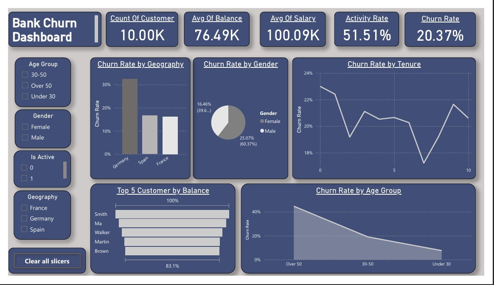
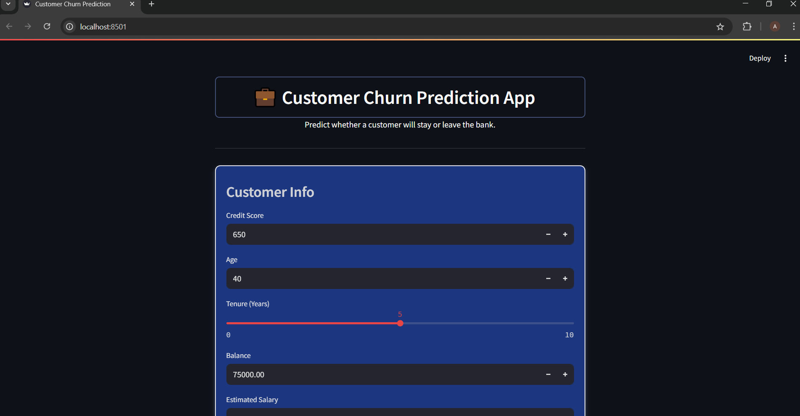

# Bank Customer Churn Prediction Project

**Author:** Aliaa Gamal  

This project predicts whether a bank customer will churn (leave) or stay using a machine learning model, based on the [Bank Customer Churn Records](data/Customer-Churn-Records.csv) dataset from [Kaggle](https://www.kaggle.com/datasets/radheshyamkollipara/bank-customer-churn/data). The goal is to identify key churn drivers and enable targeted retention strategies.

---

## Content Structure

- [Project Overview](#project-overview)
- [Dashboard](#dashboard)
- [App Interface](#app-interface)
- [Installation](#installation)
- [Usage](#usage)
- [Project Structure](#project-structure)
- [Reports](#reports)
- [Contributing](#contributing)
---

## Project Overview

The project leverages a dataset of 10,000 customer records to predict churn (`Exited`) using features like age, balance, and complaints. A Logistic Regression model achieved 100% accuracy on the test set, and the solution is deployed using Streamlit.

---

## Dashboard

The project includes a Power BI dashboard to visualize key churn metrics and insights. The dashboard is available in the `dashboard` folder as `Bank Customer Churn Dashboard.pbix` and a PDF export as `Bank Customer Churn Dashboard.pdf`.

**Dashboard**:  


---

## App Interface

The Streamlit app provides an interactive interface to predict churn for new customer data. Run the app using the instructions below to explore its features.

**App Interface**:  


---

## Installation

1. Clone the repository:
   ```bash
   git clone https://github.com/aliaagamall/data_science_projects.git
   cd Bank_Customer_Churn
   ```

2. Install dependencies:
   ```bash
   pip install -r requirements.txt
   ```

---

## Usage

1. Run the Streamlit app:
   ```bash
   streamlit run src/app.py
   ```

2. Open the app in your browser (default: `http://localhost:8501`) to predict churn for new customer data.

3. Explore the Jupyter notebook for detailed analysis:
   - `notebooks/BANK_Customer_Churn.ipynb`

---

## Project Structure

```
Bank_Customer_Churn/
├── dashboard/
│   ├── BANK Customer Churn Dashboard.pbix
│   └── BANK Customer Churn Dashboard.pdf
├── data/
│   └── Customer-Churn-Records.csv
├── images/
│   ├── CreditScore_Distribution.png
│   ├── Age_Distribution.png
│   └── (other images from reports)
├── models/
│   ├── model.pkl
│   └── scaler.pkl
├── notebooks/
│   └── BANK_Customer_Churn.ipynb
├── reports/
│   ├── Report 1 Project Overview And Goal.md
│   ├── Report 2 Exploratory Data Analysis.md
│   ├── Report 3 Data Cleaning and Preprocessing.md
│   └── Report 4 Modeling.md
├── src/
│   ├── app.py
│   ├── config.py
│   ├── model.py
│   └── test_model.ipynb
├── .gitignore
├── Dockerfile
├── README.md
└── requirements.txt
```

---

## Reports

Detailed reports are available in the `reports` folder:
1. [Project Overview](reports/Report%201%20Project%20Overview%20And%20Goal.md)
2. [Exploratory Data Analysis](reports/Report%202%20Exploratory%20Data%20Analysis.md)
3. [Data Cleaning and Preprocessing](reports/Report%203%20Data%20Cleaning%20and%20Preprocessing.md)
4. [Modeling](reports/Report%204%20Modeling.md)

---

## Contributing

1. Fork the repository.
2. Create a new branch (`git checkout -b feature/your-feature`).
3. Commit your changes (`git commit -m "Add your feature"`).
4. Push to the branch (`git push origin feature/your-feature`).
5. Open a pull request.

---