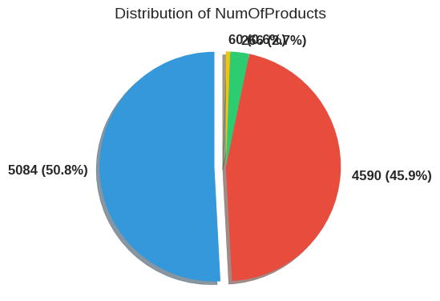

# Exploratory Data Analysis (EDA) Process

**Author:** Aliaa Gamal

## Content Structure
The following dictionary outlines the sections of this report:

- [Introduction](#introduction)
- [EDA Approach](#eda-approach)
- [Univariate Analysis Insights](#univariate-analysis-insights)
- [Statistics](#statistics)
- [Findings](#findings)
- [Preprocessing Plan](#preprocessing-plan)
- [Conclusion](#conclusion)

## Introduction
The EDA process analyzed the Customer-Churn-Records.csv dataset to uncover patterns and relationships influencing customer churn, guiding subsequent preprocessing and modeling steps. This analysis provides a foundation for understanding customer behavior and identifying key predictors of churn.

## EDA Approach
- **Univariate Analysis**: Examined distributions of individual features (numerical: CreditScore, Age, Tenure, Balance, EstimatedSalary, Points Earned; categorical: Geography, Gender, NumOfProducts, HasCrCard, IsActiveMember, Exited, Complain, Satisfaction Score, Card Type) using histograms, box plots, Q-Q plots, and pie charts.
- **Bivariate Analysis**: Explored relationships between features and Exited (e.g., Age vs. churn) with scatter plots, bar plots, and stacked bar plots.
- **Multivariate Analysis**: Investigated interactions among features using pair plots and correlation matrices to uncover complex patterns.

## Univariate Analysis Insights
### Numerical Features
- **CreditScore (Mean: 650.53, Median: 652.0, Skewness: -0.07, R²: 0.9941)**: Near-normal distribution with slight left skew; outliers below 400 indicate high-risk customers.

- **Age (Mean: 38.92, Median: 37.0, Skewness: 1.01, R²: 0.9441)**: Right-skewed with outliers above ~60; younger customers dominate, aligning with higher churn likelihood.

- **Tenure (Mean: 5.01, Median: 5.0, Skewness: 0.01, R²: 0.9489)**: Uniform distribution (0–10 years), no outliers, indicating even customer loyalty periods.

- **Balance (Mean: 76485.89, Median: 97198.54, Skewness: -0.14, R²: 0.8458)**: Zero-inflated with a right-skewed spread for non-zero values; highlights inactive accounts.

- **EstimatedSalary (Mean: 100090.24, Median: 100193.92, Skewness: 0.00, R²: 0.9569)**: Uniform distribution across a wide range, no outliers, reflecting diverse income levels.

- **Points Earned (Mean: 606.52, Median: 605.0, Skewness: 0.01, R²: 0.9555)**: Near-uniform with a slight peak at 400–600, no outliers, indicating consistent credit card usage.

### Categorical Features
- **Geography (France: 5014, Germany: 2509, Spain: 2477)**: France dominates (50.1%), suggesting regional differences in churn behavior.

- **Gender (Male: 5457, Female: 4543)**: Slight male majority (54.6%), hinting at potential gender-specific churn patterns.

- **NumOfProducts (1: 5084, 2: 4590, 3: 266, 4: 60)**: Most customers use 1–2 products (96.7%), with higher churn risk for 3–4 products.

- **HasCrCard (1: 7055, 0: 2945)**: Majority (70.5%) have a credit card, a potential loyalty factor.

- **IsActiveMember (1: 5151, 0: 4849)**: Near-equal split (51.5% active), with inactive customers at higher churn risk.

- **Exited (0: 7962, 1: 2038)**: 20.4% churn rate.

- **Complain (0: 7956, 1: 2044)**: 20.4% have complaints, strongly aligned with churn.

- **Satisfaction Score (2: 2014, 3: 2042, 4: 2008, 5: 1932)**: Evenly distributed (19.3%–20.4%), suggesting limited predictive power alone.

- **Card Type (DIAMOND: 2507, GOLD: 2502, SILVER: 2496, PLATINUM: 2495)**: Nearly equal distribution (25.0%–25.1%), indicating no dominant churn driver.

## Statistics

  - Pearson Correlation: CreditScore vs. Age (-0.004, p=0.692, non-significant).
  - Mann-Whitney U Test: Age by Exited (U=4347741.000, p=0.000, significant).
  
  - Kruskal-Wallis Test: Balance by Geography (p=0.002, significant).
  
  - Chi-Square Test: Gender vs. Exited (χ²=112.397, p=0.000, significant).
  

## Findings
- **Churn Rate**: 20.4% (2,038 customers), highlighting a class imbalance.
- **Age**: Right-skewed distribution; older customers (>45) are more likely to churn (p=0.000).
- **Geography**: France dominates (50.1%); Germany has a higher mean Balance (100,000) and potential churn risk (p=0.002).
- **Balance**: Zero-inflated distribution; higher balances (~90,000) correlate with churn (p=0.004).
- **NumOfProducts**: Customers with 3–4 products show ~50% churn vs. 15–20% for 1–2 (p=0.000).
- **Gender**: Females have a higher churn rate (25%) than males (15%) (p=0.000).
- **IsActiveMember**: Inactive members churn at ~30% vs. 10% for active (p=0.000).
- **Complain**: Strong alignment with churn (20.4% complain rate, p<0.05).
- **Satisfaction Score**: No significant association with churn (p=0.433).

## Preprocessing Plan
- **Numerical Features**:
  - Apply log transformation to Age (skewness: 1.01) and Balance (zero-inflated, skewness: -0.14) to reduce skewness.
  - Cap outliers in CreditScore, Age, Tenure, Balance, EstimatedSalary, and Points Earned using Winsorization.
- **Categorical Features**:
  - One-hot encode Geography, Gender, and Card Type (nominal variables) to convert them to numerical format for modeling.

## Conclusion
EDA revealed critical churn predictors such as age, complaints, engagement, and regional differences, while identifying data characteristics (e.g., skewness, imbalances) that informed a targeted preprocessing strategy for modeling.